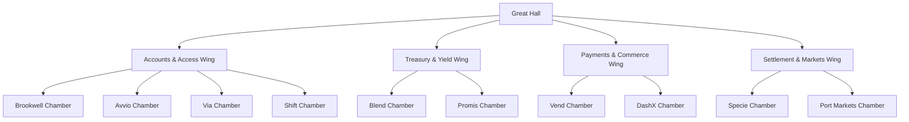

# Golem of Seismic

## Great Hall and Ten Chambers

Bu doküman oyunun yeni ana yönünü tanımlar:

`Golem of Seismic`, dövüş odaklı bir oyun değil; devasa taş bir mabette geçen, öğrenme, keşif ve anlamlandırma üstüne kurulu kısa premium bir deneyimdir.

Ana yapı:

- 1 büyük merkez salon
- 10 ayrı proje odası
- her odada kitabeler
- her odada ilgili yapının işlevini temsil eden taş mimari
- merkezde Seismic çekirdeği

Oyuncu savaşmak için değil, anlamak ve uyandırmak için ilerler.

## Temel Mekansal Kurgu

Oyunun kalbi:

`The Great Hall`

Buradan dört ana kanada ayrılan bir yapı kurulur.

Ana işlev:

- oyuncuya ölçek hissi vermek
- Seismic'i tek merkezli bir ağ olarak okutmak
- 10 odanın birbirinden kopuk değil, tek sistemin parçası olduğunu göstermek

## Genel Yerleşim Mantığı

Kategori bazlı dört kanat:

1. Accounts & Access
2. Treasury & Yield
3. Payments & Commerce
4. Settlement & Markets

Her kanatta 2 veya 3 oda bulunur.

## Top-Down Ana Şema

Not:

Bu şema saf teknik dağılım değil, duygusal mimari akış da taşır.

## 1. The Great Hall

## İşlev

- oyuncunun ilk girdiği dev merkez
- oyunun en büyük iç mekanı
- bütün odaları bağlayan sanctum düğümü

## Görünüş

- Khazad-dum ölçeğinde dev taş kolonlar
- çok yüksek tavan
- zeminde ışımayan ama çizilmiş ray halkaları
- ortada büyük, kapalı Seismic çekirdeği
- her odanın kapısına giden zemin hatları

## Mekansal Görev

Oyuncu burada şunu anlamalı:

- bu bir bina değil
- bu bir ağ mabedi

## Giriş Anı

İlk bakışta:

- kapılar kapalıdır
- isimler oyuludur
- logolar mühür gibi taş yüzeyde yer alır
- çekirdek kısık yanar

Oyuncu her odayı aktive ettikçe:

- merkez salondaki raylar canlanır
- çekirdek daha parlak olur
- büyük salon daha “uyanmış” görünür

## 2. Accounts & Access Wing

Bu kanat:

- hesap
- erişim
- güvenli giriş
- çoklu eşik

temalarını taşır.

Mimari dili daha düzenli, simetrik ve kontrollü olur.

### 2.1 Brookwell Chamber

Tema:
- safe cash account
- stable holding
- open access

Mimari:
- taş hücre duvarları
- nişler
- sakin ve dengeli geometriler
- büyük taş kasa kapısı hissi

Kapı üstü:
- `BROOKWELL`
- mühür biçiminde logo oyması

Kitabe:
- `Safe holding. Open access. Silent stability.`

### 2.2 Avvio Chamber

Tema:
- one account
- many thresholds
- global life access

Mimari:
- tek salondan çok sayıda eşik açılan oda
- farklı yüksekliklerde taş kapılar
- geçiş hissi

Kapı üstü:
- `AVVIO`

Kitabe:
- `One account. Many thresholds.`

### 2.3 Via Chamber

Tema:
- borderless capital movement
- rail continuity

Mimari:
- köprüler
- üst geçitler
- iki uç arasında taş bağlantılar

Kapı üstü:
- `VIA`

Kitabe:
- `Capital travels farther on silent rails.`

### 2.4 Shift Chamber

Tema:
- custody
- controlled access
- trusted holding

Mimari:
- mühürlü küçük giriş
- daha içe dönük bir oda
- kişisel saklama hissi

Kapı üstü:
- `SHIFT`

Kitabe:
- `Trust remains with the holder.`

## 3. Treasury & Yield Wing

Bu kanat:

- birikim
- üretken sermaye
- akışın çoğalması

temalarını taşır.

Mimari dili daha dairesel, döngüsel ve rezonans odaklı olur.

### 3.1 Blend Chamber

Tema:
- yield infrastructure
- idle value in motion

Mimari:
- dönen halka yapıları
- altar çevresi spiral akışlar
- yukarı doğru yükselen enerji çizgileri

Kapı üstü:
- `BLEND`

Kitabe:
- `Idle value should still move.`

### 3.2 Promis Chamber

Tema:
- real yield
- real economy
- grounded finance

Mimari:
- ağır rezervuar odası
- derin taş havuzlar
- yankılı dikey boşluklar

Kapı üstü:
- `PROMIS`

Kitabe:
- `Yield must answer the real world.`

## 4. Payments & Commerce Wing

Bu kanat:

- günlük hareket
- akış
- dağıtım
- ödeme ritmi

temalarını taşır.

Mimari dili daha aktif, daha çizgisel, daha “işleyen sistem” hissi taşır.

### 4.1 Vend Chamber

Tema:
- commerce
- movement
- utility

Mimari:
- oluklar
- akan taş kanallar
- dağıtım yüzeyleri

Kapı üstü:
- `VEND`

Kitabe:
- `Commerce lives in motion.`

### 4.2 DashX Chamber

Tema:
- payouts
- distribution
- orchestrated flow

Mimari:
- merkezden dışarı yayılan zemin çizgileri
- dağıtıcı taş halka sistemi
- çok yönlü akış

Kapı üstü:
- `DASHX`

Kitabe:
- `Distribution is the visible shape of the invisible rail.`

## 5. Settlement & Markets Wing

Bu kanat:

- settlement
- market structure
- trade flow

temalarını taşır.

Mimari dili daha uzun perspektifli, daha terminal ve transit hissine yakın olur.

### 5.1 Specie Chamber

Tema:
- settlement
- business banking
- reach

Mimari:
- ileri uzayan taş ray salonu
- farklı yönlere açılan kemerler
- uzaklık ve erişim hissi

Kapı üstü:
- `SPECIE`

Kitabe:
- `Settlement without friction. Reach without border.`

### 5.2 Port Markets Chamber

Tema:
- trade finance
- structured flow
- market architecture

Mimari:
- liman gibi çalışan dev taş hacim
- ağır yük olukları
- daha kurumsal ve bloklu geometri

Kapı üstü:
- `PORT MARKETS`

Kitabe:
- `Trade survives when flow finds structure.`

## Kapılar

Her odanın kapısı aynı olmayacak.
Ama ortak kurallar olacak:

- dev taş kapı
- üst lentoda isim oyulmuş
- girişte logo mühür gibi işlenmiş
- açılınca pembe ray çizgisi zeminde canlanmış

Kural:

logo tabela gibi durmamalı
taşa işlenmiş kutsal mühür gibi durmalı

## Oyun Döngüsü

1. Great Hall'a gir
2. Bir kanat seç
3. Odaya yürü
4. Kapı adı ve mühürle karşılaş
5. İç mimariyi incele
6. Kitabeyi oku
7. Odanın küçük ritüel etkileşimini aktive et
8. Merkez salona dön
9. Yeni oda aç

Bu sayede oyuncu hem gezer hem öğrenir.

## Final Durumu

10 oda aktive edilince:

- Great Hall'daki merkez çekirdek tamamen uyanır
- zemin rayları tam ağ olur
- bütün kapı isimleri hafif ışık alır
- merkezde son kitabe belirir

Son yazı önerisi:

`Seismic uyandı.`

## Tasarım Kuralı

Her oda şu iki soruya cevap vermeli:

1. Bu proje ne yapıyor?
2. Bu işlev taş mimariyle nasıl temsil edilir?

Eğer oda sadece güzel ama anlamsız görünüyorsa, yanlış tasarlanmıştır.

