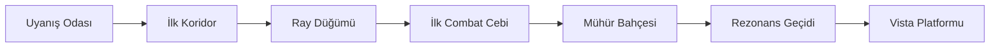

# Seismic Golem

## Level Layout V1

Bu doküman vertical slice için ilk top-down mekan akışını tanımlar.

Amaç:

- oyuncunun rotasını netleştirmek
- sahnelerin yalnızca fikir değil, yerleşim olarak da görünmesini sağlamak
- atmosfer, combat ve vista anlarının birbirini ezmeden yerleşmesini sağlamak

## Genel Kural

Bu bölüm labirent gibi olmayacak.

Aradığımız şey:

- sade
- okunaklı
- anıtsal
- kaybolmadan merak yaratan bir akış

Yani oyuncu sürekli yönünü kaybetmeyecek.
Ama her alan yeni bir hissiyat verecek.

## Akış Özeti

1. Uyanış Odası
2. İlk Koridor
3. Ray Düğümü Alanı
4. İlk Combat Cebi
5. Mühür Bahçesi
6. Rezonans Geçidi
7. Vista Platformu

## Top-Down Akış



Bu akış lineer görünür, ama her alanın içinde küçük yan bakışlar ve kısa sapmalar olabilir.

## Ölçek Hissi

Vertical slice'ta mekanlar büyük görünmeli ama aşırı uzun yürüyüş istememeli.

Hedef:

- her ana alan 20-60 saniyelik aktif kullanım versin
- alanlar arasında geçişler ritmik olsun
- koşarak 3 dakikada bitmeyecek
- ağır ağır gezince 10-12 dakika sürecek

## Alan 1: Uyanış Odası

## İşlev

- başlangıç
- ton kurma
- karakter ve çekirdeği tanıtma

## Yerleşim

- büyük dikdörtgen oda
- oyuncu odanın orta-arka kısmında uyanır
- çıkış tam karşıda, büyük taş açıklık
- yanlarda yüksek ama erişilemeyen karanlık boşluk

## Top-Down Şema

```text
┌───────────────────────────────┐
│                               │
│          karanlık boşluk      │
│                               │
│        [ GOLEM UYANIŞ ]       │
│                               │
│                               │
│                 ÇIKIŞ         │
└─────────────────────┬─────────┘
                      │
```

## Not

Bu oda küçük görünmemeli.
Boşlukla etkili olmalı.

## Alan 2: İlk Koridor

## İşlev

- yürüyüş hissi
- sanctum'un ilk nefesi
- oyuncuyu daha büyük sisteme bağlamak

## Yerleşim

- uzun, hafif dar koridor
- iki yanda büyük taş sütunlar
- zeminde sönük ray çizgileri
- koridor sonunda ilk altar düğümü

## Top-Down Şema

```text
 giriş
   │
   ▼
╔══════════════════════════════╗
║  |   |   |   |   |   |   |   ║
║                              ║
║      sönük ray hattı         ║
║                              ║
║                 [ ALTAR ]    ║
╚══════════════════════════════╝
```

## Not

Burada combat yok.
Oyuncu sadece alanı sindirmeli.

## Alan 3: Ray Düğümü Alanı

## İşlev

- ilk etkileşim
- ilk kırılabilir engel
- sanctum'un oyuncuya tepki vermesi

## Yerleşim

- koridor biraz açılır
- ortada küçük altar node
- sağda kırılabilir taş bariyer
- altar aktif olunca bariyer arkasındaki yol açılır

## Top-Down Şema

```text
         ┌───────────────┐
         │ kırılabilir   │
         │ taş bariyer   │
         └──────┬────────┘
                │
   giriş ─── [ ALTAR ] ─── açık yol
```

## Alan 4: İlk Combat Cebi

## İşlev

- ilk düşman karşılaşması
- yumruk hissi
- ilk shard ödülü

## Yerleşim

- küçük arena benzeri cep
- giriş dar, iç hacim daha açık
- bir yüksek blok veya sütun kırığı cover gibi durur
- bir düşman girişe yakın, ikinci düşman biraz içeride

## Top-Down Şema

```text
      giriş
        │
        ▼
┌──────────────────────┐
│      enemy 1         │
│                      │
│         ███          │
│                      │
│              enemy 2 │
│                      │
│        shard         │
└───────────┬──────────┘
            │
```

## Not

Bu alan çok büyük olmamalı.
İlk dövüş kısa ve tok hissettirmeli.

## Alan 5: Mühür Bahçesi

## İşlev

- puzzle hissi
- yazıt kullanımı
- sanctum'un "tanıma" mantığı

## Yerleşim

- daha simetrik bir alan
- iki küçük altar düğümü
- kapalı merkez kapı
- kapı iki düğüm aktive olunca açılır

## Top-Down Şema

```text
        [ DÜĞÜM A ]
             │
┌──────────────────────────┐
│                          │
│          KAPI            │
│                          │
│     yazıt zemini         │
│                          │
│          [ DÜĞÜM B ]     │
└──────────────────────────┘
```

## Not

Bu alan sanctum'un en törensel görünen kısmı olabilir.

## Alan 6: Rezonans Geçidi

## İşlev

- yükseliş hissi
- kısa traversal
- vista öncesi tempo hazırlığı

## Yerleşim

- dar başlayıp yükselen geçit
- birkaç kırık kenar
- aşağıda görünen boşluk
- ileride artan pembe ışık

## Top-Down Şema

```text
 giriş
   │
   ▼
╔══════════╗
║          ║
║   ↑      ║
║ yükselen ║
║  geçit   ║
║          ║
╚════╤═════╝
     │
```

## Not

Burada oyuncu hisseder:

`Ben bir eşiğe geliyorum.`

## Alan 7: Vista Platformu

## İşlev

- bölüm sonu
- oyunun ana vaadini görsel olarak satmak
- devam etme isteği yaratmak

## Yerleşim

- geniş ama boş platform
- önde korkuluk olmayan taş kenar
- karşıda sanctum'un daha büyük kısmı
- uzakta daha büyük ray ağları
- ileride kapanmış büyük kapı veya erişilemeyen altar görünür

## Top-Down Şema

```text
         giriş
           │
           ▼
┌─────────────────────────────┐
│                             │
│      geniş taş platform     │
│                             │
│                             │
│──────── uç kenar / bakış ───│
│      aşağıda dev boşluk     │
└─────────────────────────────┘
```

## Kamera Anı

Burada kamera kısa süre açılır.

Oyuncu:

- kendi küçüklüğünü
- sanctum'un büyüklüğünü
- yolculuğun daha yeni başladığını

hissetmelidir.

## Layout Tasarım Kuralları

## 1. Her alanın bir cümlesi olmalı

- Uyanış Odası: "Uyandım."
- İlk Koridor: "Burası büyük."
- Ray Düğümü: "Beni tanıyor."
- Combat Cebi: "Gücüm var."
- Mühür Bahçesi: "Bu sistem kurallı."
- Rezonans Geçidi: "Yükseliyorum."
- Vista: "Daha çok şey var."

## 2. Aynı boyut ritmi olmayacak

Alanlar hep aynı ölçekte görünmemeli.

- biri geniş
- biri dar
- biri simetrik
- biri dikey hisli

olmalı.

## 3. Her alanda tek baskın odak

Oyuncunun gözü nereye bakacağını bilsin.

Her odada:

- tek ana yapı
- tek ana kapı
- tek ana yazıt

olmalı.

## 4. Fazla platform kalabalığı yok

Bu oyun platform oyunu gibi görünmemeli.
Traversal var ama platform spam yok.

## Sonuç

Bu layout'un amacı oyuncuyu zorlamak değil;
oyuncuyu oyunun tonuna ve dünyasına inandırmak.

